# Hugh's Brews

Hugh's Brews is a website based on a fictional microbrewery created by three generations of Hugh Moloney. The website's primary objective is to introduce the viewer to the company, its owners, its selection of drinks, and the possible 'experiences' provided by the company. The company has a farm in Kildare where all its barley for its beer is farmed, where the wine is aged, and where the honey for its mead is stocked, and it offers tours and different workshops. The target audience is young Irish couples and tourists looking for an interesting field trip! The website hopes to advertise a holostic, artistic and small-business image that can provide yummy drinks and interesting tours. 

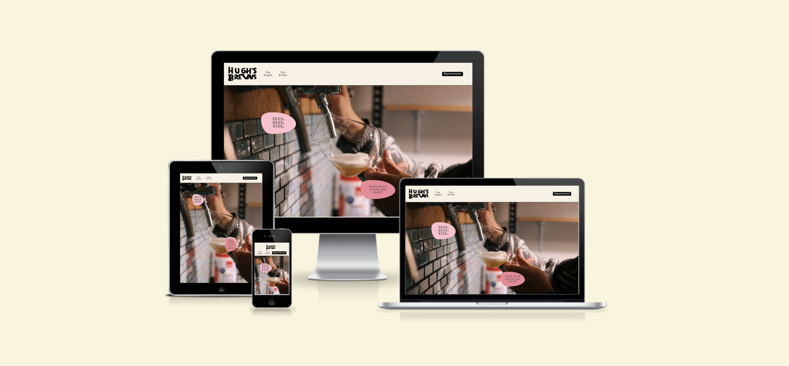

## User Experience

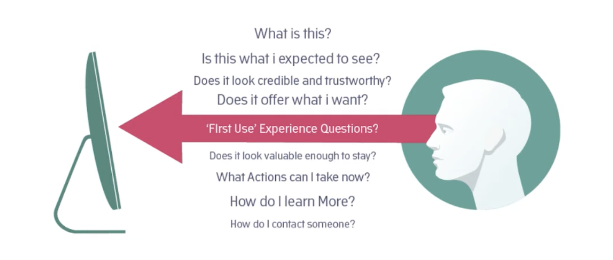

### Visitor experiences
As a first time visitor, I want to: 
- Easily find information on the background of Hugh's Brews and the purpose of the site
- Easily navigate through the site and find relevant information on experiences, beverages.
- Locate the the social media links 

As a returning visitor, I want to: 
- Sign up to the newsletter
- Read how the beers were made
- Buy the beers
- Book an experience

As a frequent visitor, I want to: 
- See what new beverages have been added
- See what new experiences have been added
- View updates on how the beverages are brewed through their social media sites.

## Design

As this is an indie company, I wanted to the design to be a little different. For this reason I chose a lighter palette of pinks, beiges, blues. 

### Colors used: 
- 'blanched almond' beige: rgb(255, 235, 205)
- 'lightblue' : rgb(173, 216, 230)
- 'pink' rgb(255, 192, 203)
- 'lightcoral' rgb(240, 128, 128)

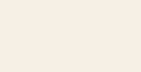

### Font used: 
The google font used is called 'Special Elite', and is reminiscent of a typewriter font.

You can find the font here: 
https://fonts.google.com/specimen/Special+Elite

## Features

### The old page: 

- __Navigation Bar__

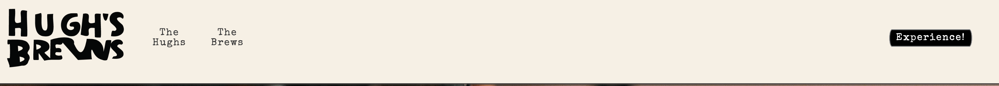

  - This is featured on all pages and is fully responsive. 
  - It has a split navigation, with the home page button (linked with the logo), about us page ("The Hughs") and products page ("The Brews") to the left. 
  - The Experiences page is to the right and in black, as this is the main atttraction of the site and tthe company's main money maker. The attractive button is there to catch viewers attention. 

- __The landing page image__

  - The landing includes a photograph of beer being poured with stylistic bubbles of text arrtfully placed. 

- __About us Section__

  - This introduces the viewer to our story. There is a nice image of three drinks in the sun behind, and again that bubble motif returning in the border raadius of the div. 
  - This bubble motif continues throughout the website. 
  - This section also provides a link to the "The Brews" page.

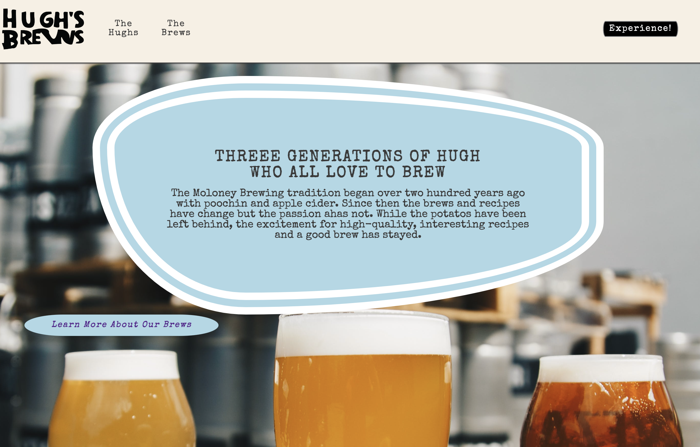

- __Farm Section__

  - This section shows an attraactive image of a farmer. It introduces the experiences in the home page in case the viewer is unlikely to click the button at the top right. 
  - This section matches the asthetci and style of the experiences page with darker colors and the same background photo. 

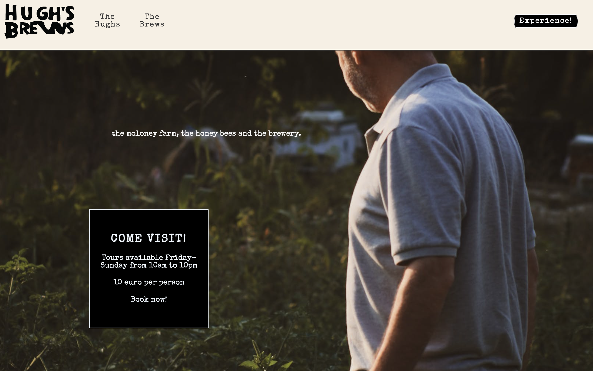

- __The Footer__ 

  - The footer, when in screens less than 678 pixels, only has icons. The mail icon on the left when pressed revels a newsletter sign up button. The others take the viewer to external tabs to our instagram, youtube, untapped and our address in google maps (compass).
  - These icons were found using fontawesome (https://fontawesome.com/icons)
  
  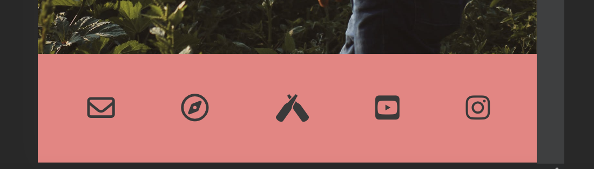
  
  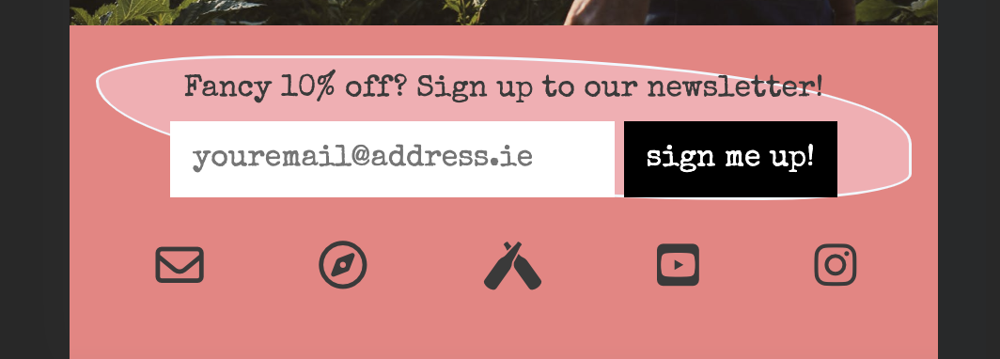

  - When the screen is larger than 678 pixels, the mail icon disappears and is replaced with the sign-up div on the left. The other icons remain on the right.

  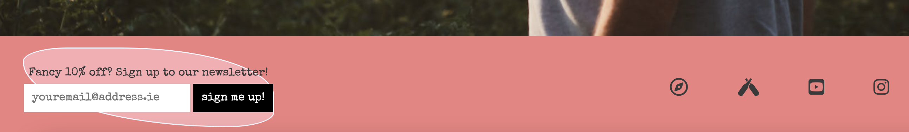

- __The Hughs__
- This page provides biographies and photos on the Hughs to give the viewer a personal connection to the owners and the brewing methods. 

- In larger screens, the pictures reveal the bios only when hovered upon. 

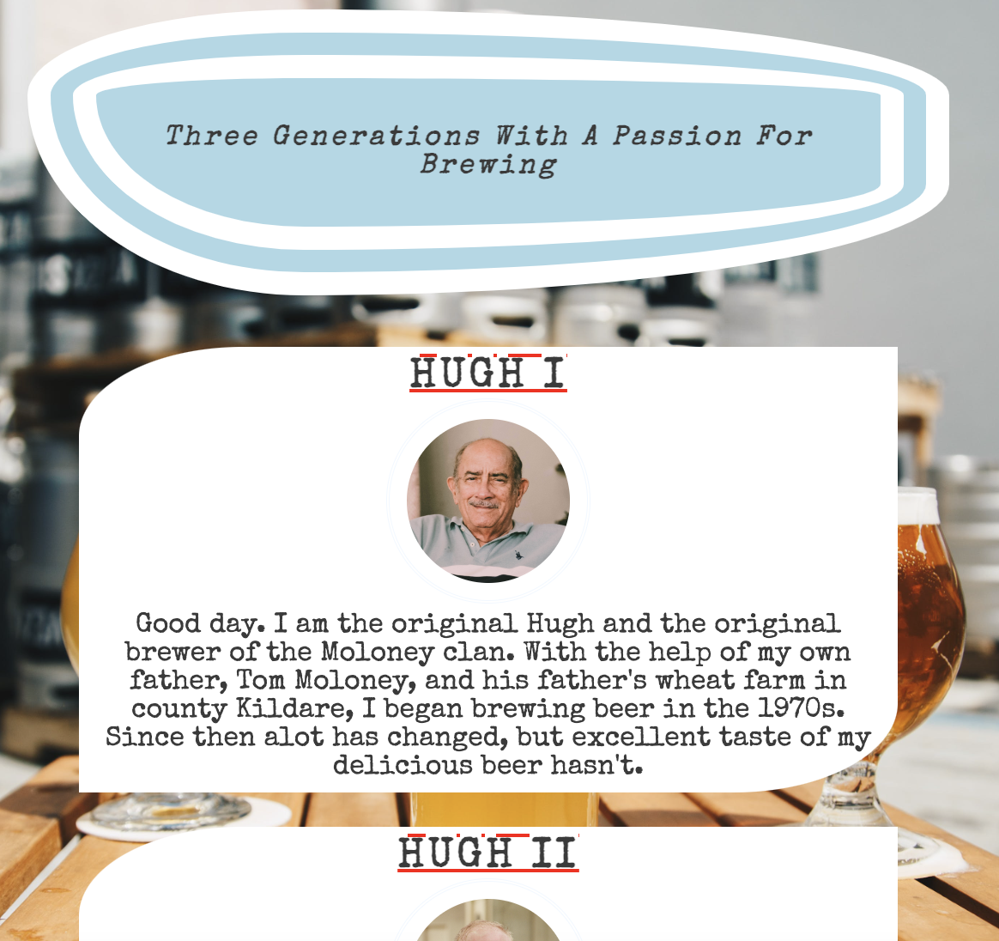

- __The Brews__
  - This page introduces the drinks with a snazzy bubble div of the same radius motif as before. When you click on each individual hover, you are taken down to an attractive image and the option to click on a link that brings you to an external buying website.
  
  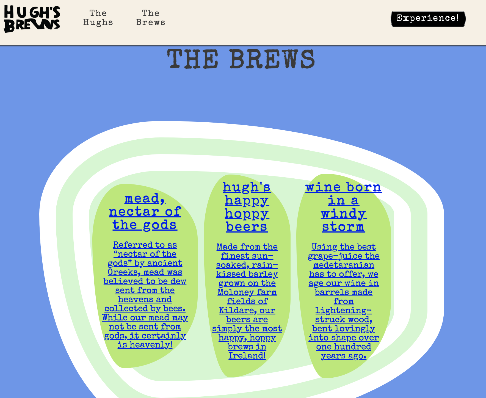

  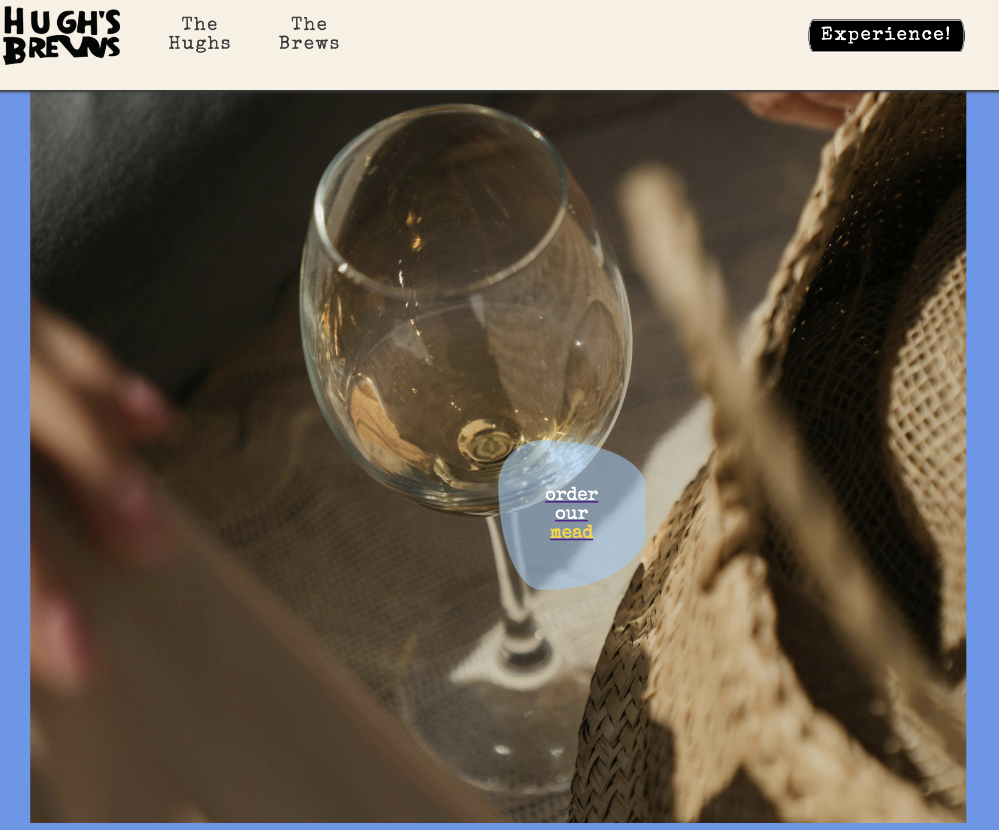

- __Experiences__
  - This page demonstraates the different experiences avaible with small descriptions and nice photos in the back. It also provides. link to the booking form. 

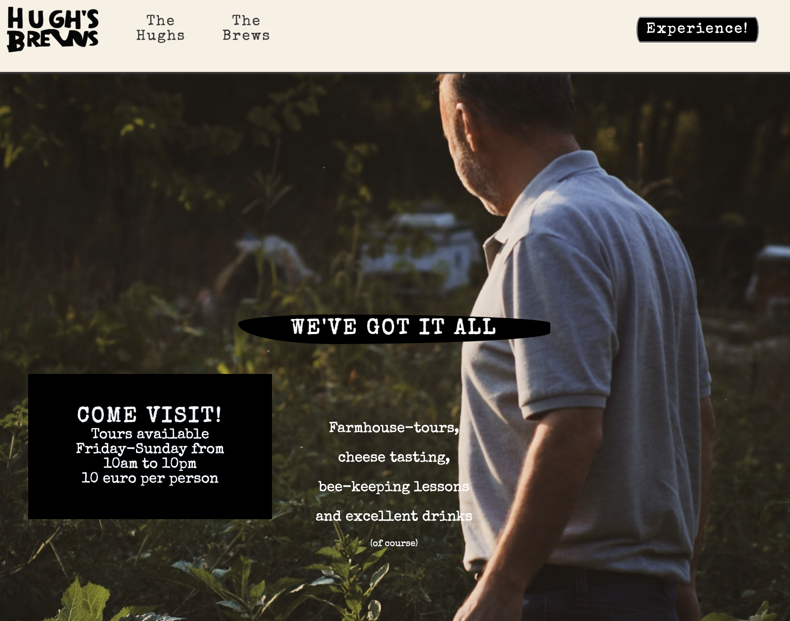

- __Booking Form__
  - This page is a simple booking form adapted from the Code Institute Lovee Running form. It simply gives a preferred booking date, activity and email address. 

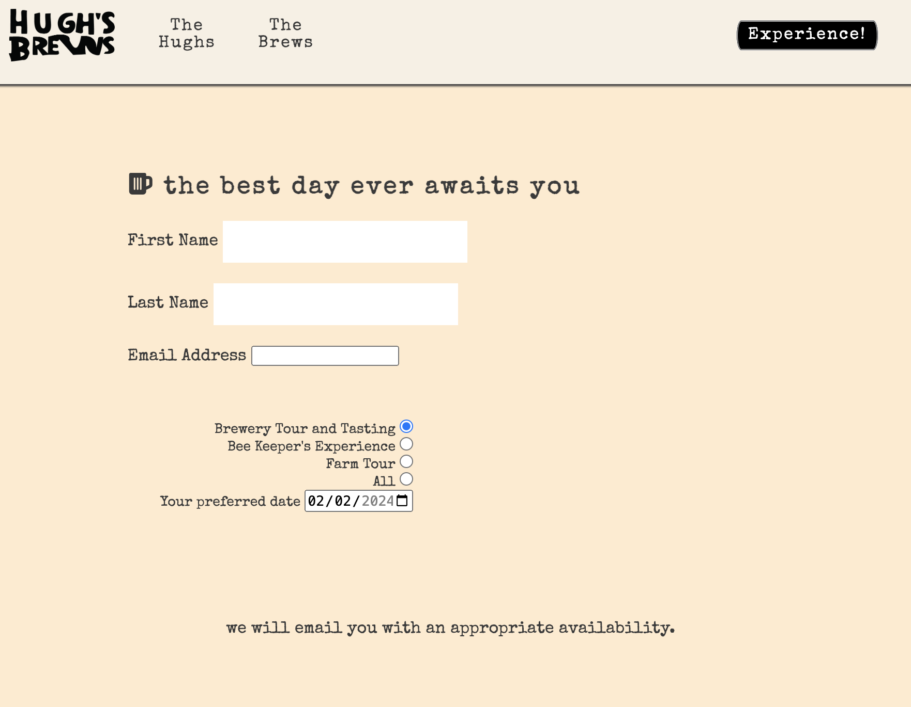

### Changes Made: 
The Hughs page was deleted and made into a seperate section on the index page as so:
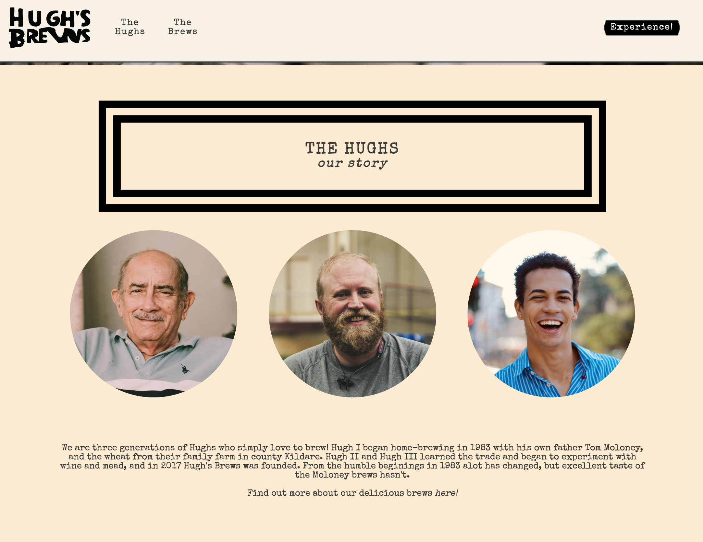

The Brews page was simplified as so:
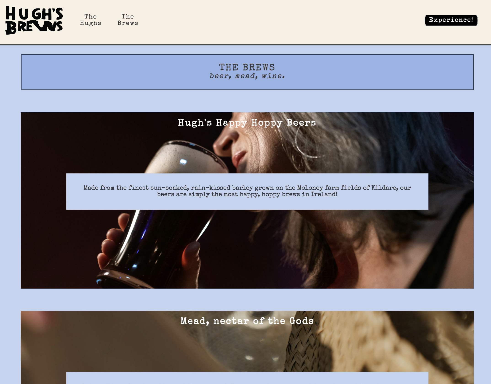
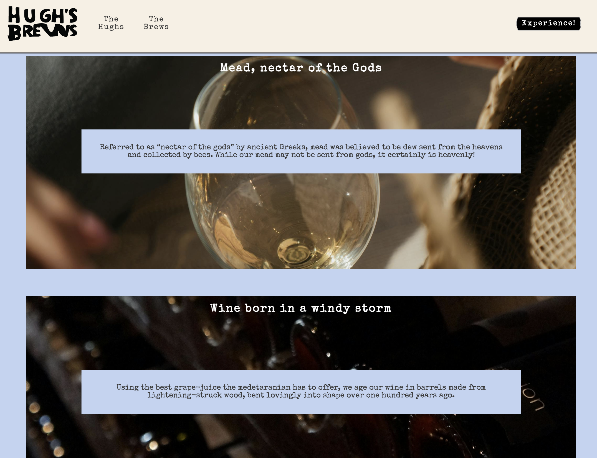
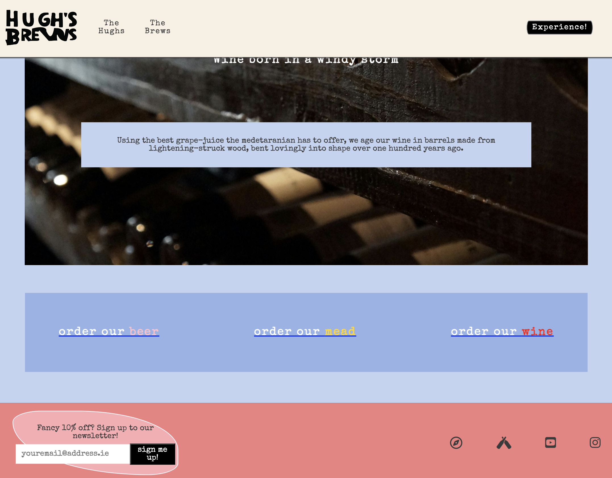

The end of the experience page was changed so there is no more floating button over the entire page, and the booking is now centered as so: 

After the experience is booked or the email for the newsletter is inputted, the user is now taken to a thank-you paage, where before was a form dump from
the code institute. 

These changes simplified the site and made it easier to naavigate.

### Features Left to Implement

- An automatic booking system in the form which shows you what dates and times are avaible. 

## Testing 

Using [Lighthouse](https://googlechrome.github.io/lighthouse/viewer/?psiurl=https%3A%2F%2F8000-arir2001-hughsbrews-rz235lbgdzz.ws-eu107.gitpod.io%2F&strategy=mobile&category=performance&category=accessibility&category=best-practices&category=seo&category=pwa&utm_source=lh-chrome-ext)

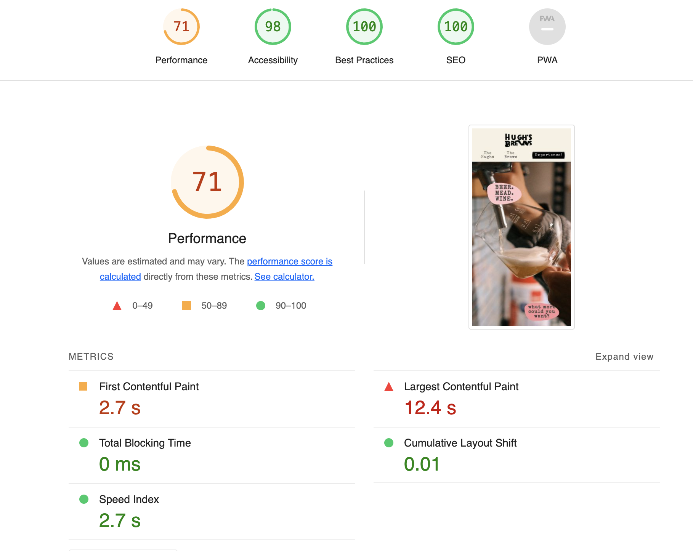

While everything was well done, the performance is poor due to the way the images were uploaded in large files. 

### Validator Testing 

- HTML
  -  Mostly syntax structure issues like trailing slashes.
  - [W3C validator](https://validator.w3.org/nu/?doc=https%3A%2F%2Farir2001.github.io%2Fhughsbrews%2F)
- CSS
  - No errors were found when passing through the official [(Jigsaw) validator](https://jigsaw.w3.org/css-validator/validator?uri=https%3A%2F%2Farir2001.github.io%2Fhughsbrews%2F&profile=css3svg&usermedium=all&warning=1&vextwarning=&lang=en)

### Unfixed Bugs

The unfixed bugs found in the validators were mainly to do with image sizing and minor syntax structure like trailing slaashes. Due to the time constrraints on this project it was deemed these could be fixed at a later date. 

The performance could be improved upon also. 

## Deployment

- The site was deployed to GitHub pages. The steps to deploy are as follows: 
  - In the GitHub repository, navigate to the Settings tab 
  - From the source section drop-down menu, select the Master Branch
  - Once the master branch has been selected, the page will be automatically refreshed with a detailed ribbon display to indicate the successful deployment. 

The live link can be found here - https://arir2001.github.io/hughsbrews/

## Credits 

### Content 

- The filler text for the experience page was taken from respective wikipedia pages: https://www.wikipedia.org/

- Instructions on how to implement a split navigation bar was from this tutorial: https://www.w3schools.com/howto/howto_css_topnav_split.asp

- The icons were taken from [Font Awesome](https://fontawesome.com/)

- The ReadMe doc, form and toggle-option on the mail icon in the footer was adapted from the Love Running page from Code Institute: https://github.com/Code-Institute-Solutions/love-running-v3

### Media

- The photos used on the home and sign up page are all from Pexels open source library: https://www.pexels.com/

- The logo waas creaated using AI generator in Adobe Illustrator using a prompt, and then edited to look smoother.

